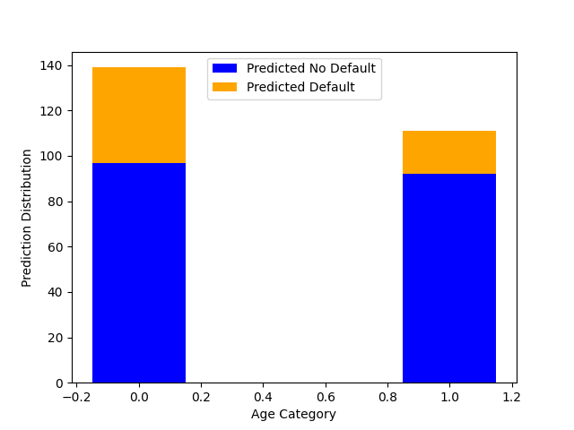

Lab 9
==========================
{: .primer-spec-toc-ignore }


## Task
In this lab, you will build another simple machine learning model with the South German Credit dataset. After building the model, you will have some practice computing the *demographic parity* fairness metrics and plotting some results with `matplotlib`.

To get started, first download the South German Credit dataset using `wget` and then create a file called `lab9.py` in the same folder as the downloaded dataset.
```terminal
$ wget https://raw.githubusercontent.com/eecs298/eecs298.github.io/main/files/south-german-credit-lab9.csv
```

### Data - South German Credit Dataset
The South German Credit dataset has information on attributes of loan applicants related to their loan application. The target variable is `LoanDefault` which is `1` if the applicant does not default on their loan (i.e., they pay it back) and `2` if the applicant does default (i.e., they do not pay it back). Refer to the [dataset documentation](https://archive.ics.uci.edu/dataset/144/statlog+german+credit+data) for more details on all of the included attributes.

Since we are going to be calculating a fairness metric in this lab, then we must define the `sensitive attribute` in this setting and it will be `Age`. 

### lab9.py
First, import `numpy`, `csv`, `sklearn`, and `matplotlib` in as follows and set the random numpy seed. If you need to install `matplotlib`, run `pip install matplotlib` in your terminal.
```python
import numpy as np
import matplotlib.pyplot as plt
from sklearn import model_selection, linear_model
import csv

np.random.seed(298)
```

Read in `south-german-credit-lab-9.csv` however you'd like and separate all the features into a list called `credit_training_features` and all the labels (`LoanDefault` column) into a list called `credit_training_labels`. Make sure to cast all the data to `ints` as you read them in. As you read in the data, you are going to convert the `Age` variable to a binary variable in the following way
* `Age` < 35, change the age to `0`.
* `Age` >= 35, change the age to `1`.

Next, split the data into training and testing sets using `model_selection.train_test_split(credit_training_features, credit_training_labels)`. Then, train a `LogisticRegression` model on the training data. Finally, generate a prediction on the testing data. Refer to Lab 7 for a refresh on these steps using `sklearn`. 

Now, we will use these predictions to calculate empirical probabilities to use in our fairness metric calculation.

### Demographic Parity
Let $$A$$ be a random variable for the sensitive attribute. In this case $$A$$ is a binary variable to indicate each age category specified above. Let $$\hat{Y}$$ be a random variable for the predicted label for each input. In this case $$\hat{Y}$$ is `1` if an applicant is predicted to not default and `2` if they are predicted to default.

Recall the definition of demographic parity from lecture:
$$
P(\hat{Y} = 1 | A = \text{Age < 35}) = P(\hat{Y} = 1 | A = \text{Age >= 35})
$$

Calculate each probability above and store the results in a dictionary such that you print out the results as follows
```output
Test probabilities: {0: 0.697841726618705, 1: 0.8288288288288288}
```
From these outputs, we can see demographic parity is **not** satisfied since the probabilities for each age category are quite different which implies that $$\hat{Y}$$ is **not** statistically independent from $$A$$.

Finally, you will use `matplotlib` to plot a stacked bar graph which shows, for each age category, the number of inputs that received a prediction of `1` and the number of inputs that received a prediction of `2`. You will use `plt.bar()` and you can read about the settings to create a stacked bar chart [here](https://matplotlib.org/stable/gallery/lines_bars_and_markers/bar_stacked.html#sphx-glr-gallery-lines-bars-and-markers-bar-stacked-py)


Your final bar graph should look as follows (don't worry if your formatting is not exactly the same, but the shape of the graph should be the same):


Turn in lab9.py on Gradescope and turn in your bar graph to the Lab 9 Graph Submission on Gradescope as well.

## Tips

### Dictionary Comprehension
We can use dictionary comprehension the same way as list comprehension to create a dictionary.
```python
keys = ["key1", "key2", "key3"]

dictionary = {k: 0 for k in keys} # intializes a dictionary where each key has value 0 to start
```

### Plotting a graph
Below gives an example of creating a simple plot using `matplotlib`. 

```python
import matplotlib.pyplot as plt # Import the library

# Data to graph
x = [1, 2, 3, 4, 5] 
y = [5, 10, 15, 20, 25]

plt.scatter(x, y) # Create a graph
# Maps data pairs to x-y coordinates 
# graph will include the points (1, 5), (2, 10), and so on

# Once a graph is created, you have a few options:
plt.show() # Open the graph in a pop-up window
plt.savefig(filepath) # Save the figure to the specified filepath
```

### Customizing your graph
Find the list of all available colors [here](https://matplotlib.org/stable/gallery/color/named_colors.html).
```python
# Specify the color and label for your line
plt.plot(x1, y1, color="tab:blue", label= "Line 1 label") 

# Can plot multiple lines per graph
plt.plot(x2, y2, color="tab:green", label="Line 2 label") 

# Label your axes as follows:
plt.xlabel('Name of X-axis') 
plt.ylabel('Name of Y-axis') 
  
# Display a title on the graph:
plt.title("Title of graph")

# Show the legend and optionally specify its location to display the labels of each line
plt.legend(loc="upper center")
plt.show()
```
